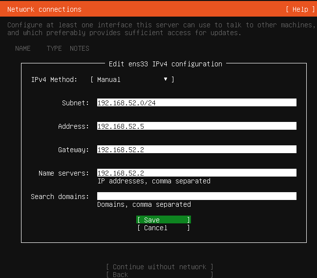
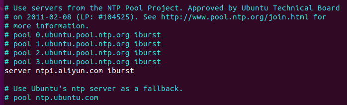

# Kubernetes Deployment

This document summarizes the Kubernetes cluster technical deployment guide.

> k3s is a Lightweight Kubernetes. Easy to install, half the memory, all in a binary of less than 100 MB.
>
> <p align="center">
>   <br>
>   <em>k3s overview</em>
> </p>

## Overview

This guide describes how to build a small Kubernetes cluster with [K3s](https://k3s.io/) on VMware-based Ubuntu virtual machines. The source material uses:

- Ubuntu Server 20.04.6 LTS
- VMware virtual machines with static IP addresses
- K3s with multiple control-plane nodes
- [HAProxy](https://www.haproxy.org/) as the Kubernetes API load balancer
- [MySQL](https://www.mysql.com/downloads/) as the external cluster datastore(or [etcd](https://etcd.io/docs/v3.6/install/), [MariaDB](https://mariadb.org/download/), [PostgreSQL](https://www.postgresql.org/download/))
- Docker as the container runtime option used in the source notes(or [containerd](https://github.com/containerd/containerd))

**This procedure is suitable for a lab or controlled internal environment. <span style="color:red;">It is not written as a hardened production baseline.</span>**

## Topology

We need two clusters to complete data collection: a production cluster for deploying services, and a monitoring cluster for deploying the monitoring stack.

| Cluster  | Hostname  | IP Address      | Role                    | Resource                |
| -------- | --------- | --------------- | ----------------------- | ----------------------- |
| producer | master1   | `192.168.52.3`  | control plane           | 2vC, 4GB Mem, 30GB Disk |
| producer | master2   | `192.168.52.6`  | control plane           | 2vC, 4GB Mem, 30GB Disk |
| producer | node1     | `192.168.52.4`  | worker                  | 2vC, 4GB Mem, 30GB Disk |
| producer | node2     | `192.168.52.5`  | worker                  | 2vC, 4GB Mem, 30GB Disk |
| producer | node3     | `192.168.52.14` | worker                  | 2vC, 4GB Mem, 30GB Disk |
| producer | node4     | `192.168.52.15` | worker                  | 2vC, 4GB Mem, 30GB Disk |
| monitor  | emanager1 | `192.168.52.9`  | control plane           | 4vC, 8GB Mem, 30GB Disk |
| monitor  | emanager2 | `192.168.52.11` | worker                  | 2vC, 4GB Mem, 30GB Disk |
| monitor  | emanager3 | `192.168.52.13` | worker                  | 2vC, 4GB Mem, 30GB Disk |
| ——       | edb1      | `192.168.52.8`  | cluser storage          | 2vC, 4GB Mem, 50GB Disk |
| ——       | lb1       | `192.168.52.7`  | api server loadbalancer | 1vC, 2GB Mem, 20GB Disk |
| ——       | dns1      | `192.168.52.10` | local dns server        | 1vC, 2GB Mem, 20GB Disk |
| ——       | nfs1      | `192.168.52.12` | local nfs server        | 1vC, 2GB Mem, 50GB Disk |

> Configuration of our lab machines:
>
> - **CPU**: E5 2673v3, 12C 24T
> - **Mem**: 64GB DDR3, 1866MHz
> - **Disk**: 1T SSD Storage

## Prerequisites

Prepare the following before installing K3s:

- **Install** VMware workstation on the host machine.
- **Download** Ubuntu Desktop / Server installation media. ( [20.04.6 LTS](https://ubuntu.com/download/alternative-downloads) )
- **Install** 13 Ubuntu Servers in VMware, where emanager1 can be the Desktop version.
- **Configure** networking for VMware: In VMware, go to Edit > Virtual Network Editor, turn off DHCP for VMnet8 (NAT), and set the subnet to `192.168.52.0/24`.
- **Deploy** MySQL on a server as the cluster datastore.

## Base Node Preparation

Perform these steps on every node unless a step is marked otherwise.

First, log in to each device as the root user.

```shell
# set root user password
sudo passwd root
sudo apt-get install openssh-server vim
sudo service sshd start
# 'PermitRootLogin without-password' -> 'PermitRootLogin yes'
sudo vim  /etc/ssh/sshd_config
sudo systemctl restart sshd.service
```

### 1. Configure Static Networking

This step will be completed during the Ubuntu Server installation.

<p align="center">
  <br>
  <em>static ip configuration</em>
</p>

### 2. Configure Hostnames

Install `vim` if needed and update `/etc/hosts` on every node:

```sh
sudo apt-get update
sudo apt-get install -y vim
sudo vi /etc/hosts
```

Example:

```text
192.168.52.3 master1
192.168.52.4 node1
192.168.52.5 node2
192.168.52.6 master2
192.168.52.7 lb1
192.168.52.8 edb1
192.168.52.9 emanager1
192.168.52.10 dns1
192.168.52.11 emanager2
192.168.52.12 nfs1
192.168.52.13 emanager3
192.168.52.14 node3
192.168.52.15 node4
```

Set a unique hostname on each node:

```sh
sudo hostnamectl set-hostname <host_name>
```

Finally, use ping to check all hostnames.

```sh
ping <host_name>
```

### 3. Disable Swap

Kubernetes requires swap to be disabled. Comment out the line containing 'swap' in `/etc/fstab` and reboot if needed.

```sh
sudo vi /etc/fstab
```

### 4. Time Synchronization

Time drift causes avoidable cluster failures. The source notes use both upstream time synchronization and internal synchronization between nodes.

The first step is to configure the time zone.

```sh
timedatectl
sudo timedatectl set-timezone Asia/Shanghai
timedatectl status
```

Update `/etc/ntp.conf` on the other nodes so they sync from the primary server, then restart `ntp`:

<p align="center">
  <br>
  <em>ntp config</em>
</p>

```sh
# Disable timesyncd to prevent conflicts with NTP
sudo timedatectl set-ntp no
sudo apt update
# Install and Restart NTP
sudo apt install -y ntp ntpstat
sudo systemctl restart ntp
sudo systemctl enable ntp
sudo systemctl status ntp
# Check if the NTP service is listening on UDP port 123.
netstat -nupl
# Check NTP synchronization status
ntpq -pn
```

Finally, set up a cron job for scheduled time synchronization.

```sh
# Set up synchronization to run every 10 minutes.
echo "*/10 * * * * /usr/sbin/ntpdate -u ntp1.aliyun.com >/dev/null 2>&1" | sudo crontab -
```

### 5. Install Docker

Install Docker packages On Cluster Machine（master1~2, node1~4, emanager1~3）

```sh
# 1. Install dependencies
sudo apt install -y apt-transport-https ca-certificates curl software-properties-common curl gnupg lsb-release

# 2. Add Docker's official GPG key
curl -fsSL http://download.docker.com/linux/ubuntu/gpg | sudo gpg --dearmor -o /usr/share/keyrings/docker-archive-keyring.gpg
# options:
curl -fsSL https://mirrors.tuna.tsinghua.edu.cn/docker-ce/linux/ubuntu/gpg | sudo gpg --dearmor -o /usr/share/keyrings/docker-archive-keyring.gpg

# 3. Add Docker repository
echo "deb [arch=$(dpkg --print-architecture) signed-by=/usr/share/keyrings/docker-archive-keyring.gpg] https://download.docker.com/linux/ubuntu $(lsb_release -cs) stable" | sudo tee /etc/apt/sources.list.d/docker.list > /dev/null
## options:
echo "deb [arch=$(dpkg --print-architecture) signed-by=/usr/share/keyrings/docker-archive-keyring.gpg] https://mirrors.tuna.tsinghua.edu.cn/docker-ce/linux/ubuntu $(lsb_release -cs) stable" | sudo tee /etc/apt/sources.list.d/docker.list > /dev/null

# 4. Install Docker
sudo apt-get update
sudo apt install -y docker-ce docker-ce-cli containerd.io docker-compose jq
sudo systemctl enable docker && sudo systemctl start docker

# 5. Configure docker-ce source
vim /etc/apt/sources.list.d/docker.list
## Add: deb [arch=amd64 signed-by=/usr/share/keyrings/docker-archive-keyring.gpg] https://mirrors.aliyun.com/docker-ce/linux/ubuntu focal stable
```

### 6. HAProxy

The source notes place HAProxy in front of the K3s servers and forward TCP `6443`.

Install HAProxy:

```sh
sudo ufw disable
# add ppa
sudo apt install software-properties-common
sudo add-apt-repository ppa:vbernat/haproxy-2.6 -y
sudo apt update
# install haproxy
sudo apt install haproxy -y
haproxy -v
sudo systemctl enable haproxy
sudo systemctl restart haproxy
sudo systemctl status haproxy
```

Edit the [configuration](../configs/environments/haproxy.cfg):

```sh
sudo vi /etc/haproxy/haproxy.cfg
## ADD:
# frontend k3s
#    bind *:6443
#    mode tcp
#    default_backend k3s

# backend k3s
#    mode tcp
#    option tcp-check
#    balance roundrobin
#    server master1 192.168.52.3:6443 check
#    server master2 192.168.52.6:6443 check
## Verify
haproxy -c -f /etc/haproxy/haproxy.cfg
```

Restart and enable the service after updating the backend list:

```sh
# check haproxy version
haproxy -v
sudo systemctl restart haproxy
sudo systemctl enable haproxy
sudo systemctl status haproxy
```

### MySQL

Install MySQL on `edb1`

```sh
sudo apt update
sudo apt install -y mysql-server mysql-client-core-8.0
sudo systemctl enable mysql
sudo systemctl start mysql
```

Allow remote connections:

```sh
sudo vi /etc/mysql/mysql.conf.d/mysqld.cnf
```

Set:

```text
bind-address = 0.0.0.0
```

Restart MySQL:

```sh
sudo systemctl restart mysql
```

Create Database and User:

```sh
sudo mysql -u root
```

Then, run the following SQL commands to create the database and the use

```sql
-- Create the database for k3s
CREATE DATABASE producer;
CREATE DATABASE monitor;

-- Create the user and allow access from any host (%)
-- Replace <password> with your actual password
CREATE USER 'producer'@'%' IDENTIFIED BY '<password>';
CREATE USER 'monitor'@'%' IDENTIFIED BY '<password>';

-- Grant privileges on the k3s database
GRANT ALL PRIVILEGES ON producer.* TO 'producer'@'%' WITH GRANT OPTION;
GRANT ALL PRIVILEGES ON monitor.* TO 'monitor'@'%' WITH GRANT OPTION;

-- Apply changes
FLUSH PRIVILEGES;

-- Exit the shell
EXIT;
```

### OPTIONS: Storage Expansion with LVM

If the VM disk has been expanded but the root filesystem has not, extend the logical volume:

```sh
df -h
sudo lvs
sudo vgdisplay
sudo lvextend -l +100%FREE /dev/mapper/ubuntu--vg-ubuntu--lv
sudo resize2fs /dev/mapper/ubuntu--vg-ubuntu--lv
```

## Install K3s

If you follow the original lab flow, disable the firewall before installation:

```sh
sudo ufw disable
```

### 1. Bootstrap the First Server

The first control-plane node initializes the cluster:

```sh
# Producer Cluser
curl -sfL https://rancher-mirror.rancher.cn/k3s/k3s-install.sh | \
  INSTALL_K3S_EXEC="server" \
  INSTALL_K3S_MIRROR=cn \
  INSTALL_K3S_CHANNEL=v1.31 \
  sh -s - \
  --system-default-registry "registry.cn-hangzhou.aliyuncs.com" \
  --cluster-init \
  --token 12345 \
  --tls-san 192.168.52.7 \
  --datastore-endpoint="mysql://producer:<password>@tcp(edb1:3306)/producer" \
  --docker

# Monitor Cluser
curl -sfL https://rancher-mirror.rancher.cn/k3s/k3s-install.sh | \
  INSTALL_K3S_EXEC="server" \
  INSTALL_K3S_MIRROR=cn \
  INSTALL_K3S_CHANNEL=v1.31 \
  sh -s - \
  --system-default-registry "registry.cn-hangzhou.aliyuncs.com" \
  --cluster-init \
  --token 12345 \
  --datastore-endpoint="mysql://monitor:<password>@tcp(edb1:3306)/monitor" \
  --docker
```

Key flags:

- `--cluster-init`: initializes the first server in the cluster
- `--token`: shared join token
- `--tls-san`: adds the load balancer IP to the API server certificate
- `--datastore-endpoint`: points K3s to the external datastore
- `--docker`: uses Docker as in the source notes
- `--system-default-registry`: uses a registry mirror

### 2. Verify the First Server

Check service health and logs:

```sh
sudo systemctl status k3s
sudo journalctl -u k3s -n 50 --no-pager
sudo journalctl -u k3s -f
```

Check nodes and system pods:

```sh
sudo k3s kubectl get nodes
sudo k3s kubectl get pods -A
```

Ensure all nodes are in 'Ready' state, and the status of all Pods should show 'Running'.

### 3. Join Worker Nodes

Get the node token from a server:

```sh
cat /var/lib/rancher/k3s/server/node-token
```

Example with Docker:

```sh
# Producer Cluser
curl -sfL https://rancher-mirror.rancher.cn/k3s/k3s-install.sh | \
  INSTALL_K3S_MIRROR=cn \
  INSTALL_K3S_EXEC="agent --docker --server https://192.168.52.3:6443 --token <YOUR_NODE_TOKEN>" \
  INSTALL_K3S_CHANNEL=v1.31 \
  sh -s -

# Monitor Cluser
curl -sfL https://rancher-mirror.rancher.cn/k3s/k3s-install.sh | \
  INSTALL_K3S_MIRROR=cn \
  INSTALL_K3S_EXEC="agent --docker --server https://192.168.52.9:6443 --token <YOUR_NODE_TOKEN>" \
  INSTALL_K3S_CHANNEL=v1.31 \
  sh -s -
```

Verify from a server:

```sh
kubectl get nodes
```

## OPTIONS: Reinstall K3S

Use the built-in uninstall script first:

```sh
/usr/local/bin/k3s-uninstall.sh
```

Stop services:

```sh
sudo systemctl stop k3s || true
sudo systemctl stop k3s-agent || true
```

Remove residual data and service files:

```sh
sudo rm -rf /etc/rancher/k3s
sudo rm -rf /var/lib/rancher/k3s
sudo rm -rf /var/lib/kubelet
sudo rm -rf /etc/systemd/system/k3s.service
sudo rm -rf /etc/systemd/system/k3s-agent.service
sudo rm -rf /run/k3s
sudo rm -rf /run/flannel
sudo rm -rf /var/lib/cni/
sudo rm -rf /var/lib/containerd/
sudo rm -rf /etc/cni/
sudo rm -rf /opt/cni/
sudo rm -rf /etc/rancher/
sudo rm -rf /usr/local/bin/kubectl
sudo rm -rf /usr/local/bin/k3s
sudo rm -rf /usr/local/bin/ctr
sudo rm -rf /usr/local/bin/crictl
sudo rm -rf /run/containerd
```

Remove leftover network interfaces and iptables rules:

```sh
sudo ip link delete cni0 || true
sudo ip link delete flannel.1 || true
sudo ip link delete kube-ipvs0 || true
sudo ip link delete cilium_* || true

sudo iptables -F
sudo iptables -X
sudo iptables -t nat -F
sudo iptables -t nat -X
sudo iptables -t mangle -F
sudo iptables -t mangle -X

sudo ip6tables -F
sudo ip6tables -X
sudo ip6tables -t nat -F
sudo ip6tables -t nat -X
sudo ip6tables -t mangle -F
sudo ip6tables -t mangle -X

sudo rm -rf ~/.kube/config
sudo systemctl daemon-reload
```

Verify cleanup:

```sh
which k3s
systemctl status k3s
ctr -n k8s.io images ls
ip a | grep cni
ip a | grep flannel
ls /var/lib/rancher
ls /etc/rancher
```
