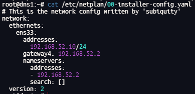

# DNS Deployment

After completing [NFS_Deployment.md](01-NFS_Deployment.md), proceed with the CoreDNS deployment for the lab DNS host.

> **This procedure is suitable for a lab or controlled internal environment. <span style="color:red;">It is not written as a hardened production baseline.</span>**

## Overview

CoreDNS is a flexible DNS server that can serve static host records and forward unresolved queries to an upstream resolver. In this lab, it is deployed on a dedicated Ubuntu host and used to provide internal name resolution for K3s-related services.

The source notes assume the following example environment:

- DNS server: `dns1` (`192.168.52.10`)
- Upstream DNS server: `192.168.52.2`
- Example internal records: `192.168.52.7 video.traefik.com`, `192.168.52.9 rancher.example.com`

## Install CoreDNS

The source notes include both a manual build path and a direct binary download path. For lab deployment, the prebuilt binary is the simpler option.

```sh
wget https://github.com/coredns/coredns/releases/download/v1.13.1/coredns_1.13.1_linux_amd64.tgz
tar -xzvf coredns_1.13.1_linux_amd64.tgz
sudo mv coredns /usr/bin/
sudo chmod +x /usr/bin/coredns
```

Create the configuration directory:

```sh
sudo mkdir -p /etc/coredns
```

## Configure the CoreDNS

Create the `systemd` unit file [coredns.service](../configs/environments/coredns.service)

```shell
# Disable 'systemd-resolved'
systemctl daemon-reload
systemctl stop systemd-resolved
systemctl disable systemd-resolved

# Add configurations
vim /etc/systemd/system/coredns.service

# Set 'DNSStubListener=yes'
vim /etc/systemd/resolved.conf
sudo systemctl daemon-reload
systemctl restart systemd-resolved

# Find the symlink target of '/etc/resolv.conf'. Then delete link '/etc/resolv.conf -> /run/systemd/resolve/stub-resolv.conf'
ll /etc/resolv.conf

# Create a new conf '/etc/resolv.conf' link to CoreDNS
cat >/etc/resolv.conf <<EOF
nameserver 192.168.52.2
options edns0
EOF

# modify upstream dns
vim /etc/netplan/00-installer-config.yaml

# Enable CoreDNS
systemctl daemon-reload
systemctl enable coredns
systemctl restart coredns
systemctl status coredns
```

<p align="center">
  <br>
  <em>coredns_netplan</em>
 </p>

Create [Corefile](../configs/environments/Corefile)

```shell
vim /etc/coredns/Corefile
```

Configuration notes:

- `bind 192.168.52.10`: listen only on the lab DNS server address
- `hosts`: serve static internal records directly
- `fallthrough`: continue processing if a hostname is not found in `hosts`
- `forward`: send unresolved queries to the upstream DNS server
- `cache`: cache responses to reduce repeated upstream lookups
- `reload`: periodically reload the configuration file

## Configure DNS forward

For each virtual machines, use Netplan for configuration.

```shell
# modify nameserver -> 192.168.52.10
vim /etc/netplan/00-installer-config.yaml
# apply
netplan apply
# test dns resolve
ping baidu.com
curl -vk https://rancher.example.

## options: also can use nmtui with GUI
sudo nmtui
```
