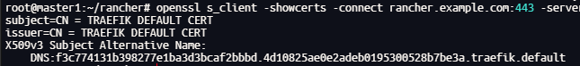

# Rancher Install

> **This procedure is suitable for a lab or controlled internal environment. <span style="color:red;">It is not written as a hardened production baseline.</span>**

## Overview

Rancher is a Kubernetes management platform for operating one or more clusters from a single control plane. In this lab flow, Rancher is deployed on a separate K3s management cluster instead of sharing resources with application workloads.

This document focuses on the Rancher server installation framework only. Downstream cluster import, advanced hardening, backup, and upgrade strategy should be handled as follow-up tasks.

## Recommended Lab Layout

The source notes assume a small dedicated management environment:

- Rancher management node: `emanager1` (`192.168.52.9`)
- Rancher hostname: `rancher.example.com`
- Internal DNS already resolves the hostname to the Rancher entrypoint
- `cert-manager` is available for issuing the Rancher ingress certificate

If you follow the same lab design, complete these documents first:

- [Kubernetes Deployment](../deploy/00-Kubernetes_Deployment.md)
- [DNS Deployment](../deploy/02-DNS_Deployment.md)
- [Cert-Manager Install](./03-CertManager_Install.md)

## Prerequisites

Prepare the following before installing Rancher:

- a working K3s management cluster with `kubectl` access:
  ```shell
  sudo vim ~/.bashrc
  ## add:  export KUBECONFIG=/etc/rancher/k3s/k3s.yaml
  source ~/.bashrc
  ```
- `helm` installed on the administrative host
- a DNS record for `rancher.example.com`: just modify [Corefile](../../configs/environments/Corefile))
- a certificate strategy for the Rancher ingress
- network access from users and downstream clusters to the Rancher hostname

## Install Rancher On Monitor Cluser

### 1. Create Monitor CA & CluserIssuer

Create a [cluster_issuer.yaml](../../configs/pipelines/rancher-install/cluster_issuer.yaml)

```sh
# create cluster issuer for CA
kubectl apply -f cluster_issuer.yaml
```

Create a [ca_certificate.yaml](../../configs/pipelines/rancher-install/ca_certificate.yaml)

```sh
# create certificate for CA
kubectl apply -f ca_certificate.yaml
```

Create a [ca_issuer.yaml](../../configs/pipelines/rancher-install/ca_issuer.yaml)

```sh
# create a CA Issuer
kubectl apply -f ca_issuer.yaml
# check ca issuer
kubectl get clusterissuer
```

### 2. Install Rancher On Monitor

First, add the Helm chart.

```sh
helm repo add rancher-latest https://releases.rancher.com/server-charts/latest
```

Then, create the namespace and install Rancher.

```sh
# create namspace
kubectl create namespace cattle-system
# install opertaion
helm install rancher rancher-latest/rancher  \
--namespace cattle-system \
--set-string bootstrapPassword="123456" \
--set-string ingress.tls.source="rancher" \
--set auditLog.level=1 \
--set addLocal="true" \
--set ingress.extraAnnotations.'cert-manager\.io/cluster-issuer'=monitor-ca-issuer \
--set hostname=rancher.example.com \
--set replicas=1 \
--set privateCA=false \
--set rancherImagePullPolicy=IfNotPresent \
--set proxy="http://<proxy_url:proxy_port>/" \
--set noProxy=127.0.0.0/8\\,10.0.0.0/8\\,cattle-system.svc\\,172.16.0.0/12\\,.svc\\,.cluster.local
```

Alternatively, create a configuration [file](../../configs/pipelines/rancher-install/rancher-values.yaml).

```sh
helm install rancher rancher-latest/rancher \
  --namespace cattle-system \
  -f rancher-values.yaml
```

Finally, verify the installation.

```sh
# All pods should be in the Running state.
kubectl rollout status deployment -n cattle-system rancher
kubectl get pods -n cattle-system
```

### 3. Upload Produceer Cluster to Monitor(Rancher)

In the Rancher Web UI, select the option to import an existing cluster, which will then generate a URL.

For example

```sh
# Download the YAML configuration to join the Rancher management platform.
curl --insecure -o kubeconfig.yaml https://rancher.example.com/v3/import/gb6q7mh9chxpwjlc52nr4kkt828h8rcf9k66gjk6xxqn4grzb56swx_c-fc2vs.yaml

# apply and join rancher
kubectl apply -f kubeconfig.yaml
```

**Troubleshoot**

> ```log
> time="2025-11-30T14:09:13Z" level=error msg="Could not securely connect to https://rancher.example.com: Get \"https://rancher.example.com\": tls: failed to verify certificate: x509: certificate is valid for f3c774131b398277e1ba3d3bcaf2bbbd.4d10825ae0e2adeb0195300528b7be3a.traefik.default, not rancher.example.com"
> ```

This indicates that while the cattle-cluster-agent is accessing https://rancher.example.com, the actual HTTPS certificate returned is for `f3c7....4d10....traefik.default`. Since this certificate is neither issued for `rancher.example.com` nor signed by the CA you configured in `Monitor`, the validation fails directly, causing the Pod to enter an Error state.

First, verify which certificate Rancher is currently using.

```sh
openssl s_client -showcerts -connect rancher.example.com:443 -servername rancher.example.com </dev/null 2>/dev/null | openssl x509 -noout -subject -issuer -ext subjectAltName
```

<p align="center">
   <br>
</p>
By testing the access from master1, you will find that a request to rancher.example.com:443 actually returns the default Traefik certificate from the K3s cluster, rather than the intended certificate for the Rancher management cluster.

**How to fix it?**

1. First, check the TLS configuration of the Ingress, as Traefik relies on the Ingress rules to route traffic properly.

   ```sh
   # Get all ingress
   kubectl -n cattle-system get ingress
   # Find TLS
   kubectl -n cattle-system describe ingress rancher
   ```

2. Verify if `tls-rancher-ingress` exists. Upon discovering that it is missing, we now need to actually generate a Kubernetes TLS Secret named `tls-rancher-ingress` in the cattle-system namespace. The certificate's SAN must include `rancher.example.com`, and the CA must match the Monitor CA configuration.

   ```sh
   # 1. check 'tls-rancher-ingress'
   kubectl -n cattle-system get secret tls-rancher-ingress -o yaml
   # Option: create tls-rancher-ingress with rancher-certificate.yaml
   kubectl apply -f rancher-certificate.yaml
   kubectl -n cattle-system describe certificate rancher-example-

   # 2. export tls-rancher-ingress to /tmp/rancher-tls.crt to check SAN and issuer
   kubectl -n cattle-system get secret tls-rancher-ingress -o jsonpath='{.data.tls\.crt}' | base64 -d > /tmp/rancher-tls.crt
   openssl x509 -in /tmp/rancher-tls.crt -noout -subject -issuer -ext subjectAltName

   # 3. Verify that the Rancher cacerts matches the actual CA.
   # 3.1 export ca that monitor cluster actually used
   kubectl -n cert-manager get secret monitor-ca-secret -o jsonpath='{.data.tls\.crt}' | base64 -d > /tmp/rancher-ca.crt
   # 3.2 verify monitor cluster ca
   openssl x509 -in /tmp/rancher-ca.crt -noout -subject -issuer -fingerprint
   # 3.3 verify tls secret that rancher actually used
   kubectl -n cattle-system get secret tls-rancher-ingress -o jsonpath='{.data.tls\.crt}' | base64 -d > /tmp/rancher-tls.crt
   openssl x509 -in /tmp/rancher-tls.crt -noout -subject -issuer
   openssl x509 -in /tmp/rancher-tls.crt -text -noout | grep -A2 "Subject Alternative Name"

   # 4. Update the cacerts of rancher using the monitor CA: Check if cacerts is currently populated, then edit it by pasting the value from /tmp/rancher-ca.crt.
   kubectl get settings.management.cattle.io cacerts -o yaml
   kubectl edit settings.management.cattle.io cacerts

   # 5. test
   openssl s_client -showcerts -connect rancher.example.com:443 -servername rancher.example.com </dev/null 2>/dev/null | openssl x509 -noout -subject -issuer -ext subjectAltName
   ```

   - [rancher-certificate.yaml](../../configs/pipelines/rancher-install/rancher-certificate.yaml)
