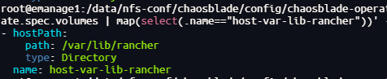

# ChaosBlade Install

> **This procedure is suitable for a lab or controlled internal environment. <span style="color:red;">It is not written as a hardened production baseline.</span>**

## Overview

ChaosBlade Platform is used here as a visual chaos engineering control plane for Kubernetes experiments. The source notes combine three major components:

- `chaosblade-operator`: the Kubernetes operator that applies ChaosBlade CRDs for node and pod fault injection
- `chaosblade-tool`: the actual execution engine used by the operator for Kubernetes-side fault injection

## Deploy ChaosBlade Operator

> **ChaosBlade needs to be installed into the Producer cluster.**

Add the upstream Helm repository:

```sh
helm repo add chaosblade-io https://chaosblade-io.github.io/charts
helm repo update
helm search repo chaosblade
```

Export the values if you want to review them:

```sh
helm show values chaosblade-io/chaosblade-operator --version 1.7.3 > chaosblade-values.yaml
```

Install the operator:

```sh
helm install chaosblade-operator chaosblade-io/chaosblade-operator \
  --namespace chaosblade \
  --create-namespace
```

We patch the `chaosblade-tool` DaemonSet to mount `/var/lib/rancher`, which is required for the local K3s environment.

> [chaosblade-post-render.sh](../../scripts/pipelines/chaosblade/chaosblade-post-render.sh)

```sh
sed -i 's/\r$//' ./chaosblade-post-render.sh
chmod +x ./chaosblade-post-render.sh
```

Upgrade the operator with the patch and enable the webhook:

```sh
helm upgrade --install chaosblade-operator chaosblade-io/chaosblade-operator \
  -n chaosblade \
  --set webhook.enable=true \
  --post-renderer ./chaosblade-post-render.sh
```

Validate that the extra volume and mount are present:

```sh
kubectl -n chaosblade get ds chaosblade-tool -o yaml \
  | yq e '.spec.template.spec.volumes | map(select(.name=="host-var-lib-rancher"))' -

kubectl -n chaosblade get ds chaosblade-tool -o yaml \
  | yq e '.spec.template.spec.containers[] | select(.name=="chaosblade-tool") | .volumeMounts | map(select(.name=="host-var-lib-rancher"))' -
```



configure PVC volumes for ChaosBlade

> [chaosblade-pvc.yaml](../../configs/pipelines/chaosblade/chaosblade-pvc.yaml)

## 7. Verify The Installation

After installing Operator, confirm that the namespace contains the expected components:

```sh
kubectl -n chaosblade get pods
kubectl -n chaosblade get deploy, ds, svc
```

At minimum, you should see components corresponding to:

- `chaosblade-operator`
- `chaosblade-tool`

From an operational perspective, the most important checks are:

- `chaosblade-tool` exists on the required nodes
- the operator webhook is enabled and healthy
