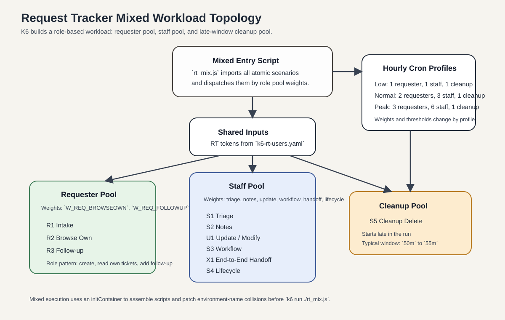

# Request Tracker Traffic Injection Design

This document summarizes the K6-based Request Tracker (RT) traffic injection design used on the K3s cluster. The design targets a deployed RT service and generates realistic REST2 ticketing traffic for validation, steady-state simulation, and periodic workload replay.

The related RT platform deployment is described in [20-RequestTracker-Deploy.md](../workload/20-RequestTracker-Deploy.md).

## Objectives

The traffic injection design has four goals:

- Validate that the deployed RT instance, REST2 API, user tokens, and queue permissions are working correctly.
- Reproduce realistic ticket-system activity across requester, staff, and cleanup roles instead of benchmarking isolated endpoints only.
- Run one-off Jobs for scenario verification and hourly CronJobs for long-running workload replay.
- Produce K6 runtime metrics and structured log artifacts that can be correlated with RT, PostgreSQL, ingress, and cluster monitoring data.

## Deployment Model & Scenario Architecture

The design uses a dedicated Kubernetes namespace, usually `traffic`, to isolate all K6 resources from the RT application namespace.

- **ConfigMap**: stores per-scenario environment settings and K6 scripts.
- **Job**: runs a single scenario or a mixed scenario for ad hoc testing.
- **CronJob**: runs the mixed scenario on a schedule to simulate a full business day.
- [Secret](../../configs/traffics/k6-rt-users.yaml): stores RT API tokens for root, requester, and staff test users.
- [PersistentVolumeClaim](../../configs/traffics/k6-pvc.yaml): stores K6 output files for later inspection.

Unlike the Gitea and Wiki.js traffic models, the RT design is role-driven. It does not simply run many endpoint families in parallel. Instead, it organizes activity into three cooperating pools:

- Requester pool: create tickets, browse owned tickets, and send follow-up messages.
- Staff pool: triage queue views, internal notes, field updates, workflow progression, handoff, and lifecycle operations.
- Cleanup pool: delete or mark synthetic tickets as deleted near the end of the run.

The mixed workload therefore models a ticket system as a collaboration chain rather than a flat list of unrelated API calls.

The runtime design uses:

- One script per atomic scenario.
- A shared `k6-rt-users.yaml` secret that provides `users.json`.
- A mixed entry script that imports all scenario scripts and dispatches by role pool.
- An `initContainer` that assembles all scripts into `/scripts` and patches environment-name collisions before K6 starts.

The current mixed CronJob explicitly rewrites conflicting variable names for:

- `MODE` used by both follow-up and lifecycle flows
- `SUBJECT_PREFIX` used by preflight, intake, and workflow flows

This patching step is necessary because all scenario modules run inside one K6 process during mixed execution.

> - [k6-rt-users.yaml](../../configs/traffics/k6-rt-users.yaml)
> - [k6-rt-mix-script.yaml](../../configs/traffics/k6-rt-mix-script.yaml)
> - [k6-rt-mix-job.yaml](../../configs/traffics/k6-rt-mix-job.yaml)
> - [k6-rt-mix-cron.yaml](../../configs/traffics/k6-rt-mix-cron.yaml)

## 1. Validation Scenario

This scenario validates the RT environment before longer workloads are executed:

- Check `GET /REST/2.0/rt`
- Verify requester and staff user identity through `GET /user/:name`
- Verify queue visibility through `GET /queues/all`
- Create a test ticket
- Read ticket detail and history
- Add a staff comment
- Exercise a simple status transition
- Optionally delete the created ticket

This scenario acts as a functional gate. If it fails, the mixed workload should not proceed.

> - [k6-rt-preflight-env.yaml](../../configs/traffics/k6-rt-preflight-env.yaml)
> - [k6-rt-preflight-script.yaml](../../configs/traffics/k6-rt-preflight-script.yaml)
> - [k6-rt-preflight-job.yaml](../../configs/traffics/k6-rt-preflight-job.yaml)

## 2. Requester Scenarios

### 2.1 Requester Intake

This scenario simulates new ticket creation by requesters:

- Create a new ticket in the configured queue.
- Optionally read the created ticket immediately.
- Optionally read its history after creation.

The script uses a subject and content prefix strategy so synthetic tickets can be identified later by staff workflows and cleanup logic.

> - [k6-rt-intake-env.yaml](../../configs/traffics/k6-rt-intake-env.yaml)
> - [k6-rt-intake-script.yaml](../../configs/traffics/k6-rt-intake-script.yaml)
> - [k6-rt-intake-job.yaml](../../configs/traffics/k6-rt-intake-job.yaml)

### 2.2 Requester Browse Own

This scenario simulates requesters browsing their own tickets:

- Search tickets with TicketSQL templates filtered to the current requester.
- Open a selected ticket.
- Optionally read ticket history.
- Optionally refresh queue visibility.

This represents read-heavy self-service activity and is usually the dominant requester-side load in low traffic.

> - [k6-rt-browseown-env.yaml](../../configs/traffics/k6-rt-browseown-env.yaml)
> - [k6-rt-browseown-script.yaml](../../configs/traffics/k6-rt-browseown-script.yaml)
> - [k6-rt-browseown-job.yaml](../../configs/traffics/k6-rt-browseown-job.yaml)

### 2.3 Requester Follow-up

This scenario simulates requesters adding more information after ticket creation:

- Search for a candidate ticket using TicketSQL templates.
- Post either `correspond` or `comment`.
- Optionally verify history and ticket detail after the write.

The script supports `correspond`, `comment`, or a weighted mix of both, which makes it suitable for modeling customer replies and clarifications.

> - [k6-rt-followup-env.yaml](../../configs/traffics/k6-rt-followup-env.yaml)
> - [k6-rt-followup-script.yaml](../../configs/traffics/k6-rt-followup-script.yaml)
> - [k6-rt-followup-job.yaml](../../configs/traffics/k6-rt-followup-job.yaml)

## 3. Staff Scenarios

### 3.1 Staff Triage

This scenario models queue-oriented staff review:

- Query queue tickets with TicketSQL templates.
- Optionally call `queues/all`.
- Open a selected ticket.
- Optionally read ticket history.

This is the primary read path for support engineers and operators handling incoming work.

> - [k6-rt-triage-env.yaml](../../configs/traffics/k6-rt-triage-env.yaml)
> - [k6-rt-triage-script.yaml](../../configs/traffics/k6-rt-triage-script.yaml)
> - [k6-rt-triage-job.yaml](../../configs/traffics/k6-rt-triage-job.yaml)

### 3.2 Staff Notes

This scenario simulates internal staff comments:

- Search for a candidate ticket.
- Post an internal comment.
- Optionally verify ticket history and detail afterwards.

It represents collaborative internal ticket processing without necessarily changing ownership or workflow state.

> - [k6-rt-notes-env.yaml](../../configs/traffics/k6-rt-notes-env.yaml)
> - [k6-rt-notes-script.yaml](../../configs/traffics/k6-rt-notes-script.yaml)
> - [k6-rt-notes-job.yaml](../../configs/traffics/k6-rt-notes-job.yaml)

### 3.3 Ticket Update / Modify

This scenario performs field-level mutation on existing tickets:

- Search for a target ticket.
- Optionally pre-read it.
- Update fields such as subject, priority, owner, status, or configured custom fields.
- Verify the change through `GET /ticket/:id` and optional history reads.

This is the generic attribute-update path and is distinct from lifecycle-specific status progression.

> - [k6-rt-update-env.yaml](../../configs/traffics/k6-rt-update-env.yaml)
> - [k6-rt-update-script.yaml](../../configs/traffics/k6-rt-update-script.yaml)
> - [k6-rt-update-job.yaml](../../configs/traffics/k6-rt-update-job.yaml)

### 3.4 Staff Workflow

This scenario exercises a light-weight workflow mutation path:

- Search for a ticket.
- Optionally pre-read it.
- Apply a mutable patch such as subject, priority, owner, status, or custom fields.
- Verify through follow-up reads and optional history checks.

Functionally, this scenario sits between simple update and full lifecycle progression.

> - [k6-rt-workflow-env.yaml](../../configs/traffics/k6-rt-workflow-env.yaml)
> - [k6-rt-workflow-script.yaml](../../configs/traffics/k6-rt-workflow-script.yaml)
> - [k6-rt-workflow-job.yaml](../../configs/traffics/k6-rt-workflow-job.yaml)

### 3.5 End-to-End Handoff

This scenario is the most business-complete single workflow:

- A requester creates a ticket.
- A staff user searches and finds that specific ticket.
- Staff reads, comments, corresponds, and resolves the ticket.
- The requester reopens the conversation path by browsing and optionally following up.
- Cleanup can mark the ticket deleted at the end.

This scenario is closer to a mini business process than a simple endpoint benchmark and is useful for validating cross-role visibility and handoff behavior.

> - [k6-rt-handoff-env.yaml](../../configs/traffics/k6-rt-handoff-env.yaml)
> - [k6-rt-handoff-script.yaml](../../configs/traffics/k6-rt-handoff-script.yaml)
> - [k6-rt-handoff-job.yaml](../../configs/traffics/k6-rt-handoff-job.yaml)

### 3.6 Staff Lifecycle

This scenario drives explicit status transitions:

- Search for a target ticket.
- Read current status.
- Compute the next status from a configured cycle or pair-based rule set.
- Apply the new status with `PUT /ticket/:id`.
- Verify via ticket detail and optional history reads.

This is the dedicated workflow-state scenario and should be used when the objective is to stress status transitions rather than generic ticket edits.

> - [k6-rt-lifecycle-env.yaml](../../configs/traffics/k6-rt-lifecycle-env.yaml)
> - [k6-rt-lifecycle-script.yaml](../../configs/traffics/k6-rt-lifecycle-script.yaml)
> - [k6-rt-lifecycle-job.yaml](../../configs/traffics/k6-rt-lifecycle-job.yaml)

## 4. Cleanup Scenario

This scenario cleans up synthetic tickets at the end of a run:

- Search for candidates using configured TicketSQL templates.
- Verify they match expected synthetic prefixes.
- Optionally resolve them first.
- Mark them deleted, usually with `PUT Status=deleted`.

The script deliberately prefers status-based deletion over `DELETE /ticket/:id` because the notes indicate the direct REST2 delete path can be less stable in some environments.

Cleanup is intentionally scheduled as a late-window action so it does not compete with the main requester and staff paths for the full run duration.

> - [k6-rt-cleanup-env.yaml](../../configs/traffics/k6-rt-cleanup-env.yaml)
> - [k6-rt-cleanup-script.yaml](../../configs/traffics/k6-rt-cleanup-script.yaml)
> - [k6-rt-cleanup-job.yaml](../../configs/traffics/k6-rt-cleanup-job.yaml)

## 5. Mixed Workload Design

The RT mixed workload is designed as a role-oriented collaboration model rather than a flat weighted blend of unrelated API operations.

The mixed entry script defines three K6 executors:

- `requester_pool`
- `staff_pool`
- `cleanup_pool`

Each pool then performs weighted dispatch internally:

- Requester pool: `browseown`, `followup`, `intake`
- Staff pool: `triage`, `notes`, `update`, `workflow`, `handoff`, `lifecycle`
- Cleanup pool: `cleanup`

This design is materially different from the Gitea mixed workload. The concurrency model is not “all actions at once.” Instead, it reflects the fact that RT load is dominated by role-specific behaviors with different frequencies and different write intensities.

### 5.1 Pool Weights

The source notes define the following default mixed-role pattern:

- Requester pool weights: browse own first, follow-up second, intake third
- Staff pool weights: triage and notes dominate, while handoff and lifecycle remain smaller
- Cleanup pool: enabled only late in the run

The actual mixed script builds these weights from environment variables:

- `W_REQ_BROWSEOWN`
- `W_REQ_FOLLOWUP`
- `W_REQ_INTAKE`
- `W_ST_TRIAGE`
- `W_ST_NOTES`
- `W_ST_UPDATE`
- `W_ST_WORKFLOW`
- `W_ST_HANDOFF`
- `W_ST_LIFECYCLE`

### 5.2 Scheduled Profiles

The source notes define three daily profiles for the mixed workload.

| Profile  | Duration | Requester VUs | Staff VUs | Cleanup VUs | Sleep range                                           | Requester weights | Staff weights      | Thresholds                     |
| -------- | -------- | ------------: | --------: | ----------: | ----------------------------------------------------- | ----------------- | ------------------ | ------------------------------ |
| Off-peak | `55m`    |             1 |         1 |           1 | `1` to `5s` in notes, `2.0` to `5.0s` in CronJob YAML | `75/10/15`        | `40/20/20/10/5/5`  | fail `< 0.05`, p95 `< 6000 ms` |
| Normal   | `55m`    |             2 |         3 |           1 | `1.2` to `3.5s`                                       | `55/25/20`        | `30/25/20/10/10/5` | fail `< 0.02`, p95 `< 4500 ms` |
| Peak     | `55m`    |             3 |         6 |           1 | `0.8` to `2.5s`                                       | `40/30/30`        | `25/25/20/15/10/5` | fail `< 0.03`, p95 `< 5500 ms` |

The cleanup phase is enabled in all three profiles, but it starts late:

- `CLEANUP_START=50m`
- `CLEANUP_DURATION=5m`

This keeps cleanup behavior out of the main role pools and better reflects how operators would batch-delete synthetic tickets at the end of a run.

## 6. Scheduling Strategy

The mixed workload is designed to run as an hourly CronJob:

- One run starts every hour.
- Each run lasts about `55m`.
- `concurrencyPolicy: Forbid` prevents overlapping runs.
- A PVC-backed output directory preserves logs and summary files.

The source prose and the current CronJob YAML are close but not identical. The YAML should be treated as the effective schedule. The current configuration uses:

- `PEAK_HOURS="09 10 11 14 15 16 17"`
- `LOW_HOURS="00 01 02 03 04 05 06 07 12 21 22 23"`
- All other hours fall into the `normal` profile

This creates a daily pattern with overnight quiet periods, midday and evening low-load windows, and a daytime peak shaped around business handling hours.

## 7. Log And Artifact Retention

The scheduled run mounts a PVC, typically `k6-logs-pvc`, at `/logs` and writes output under an RT-specific directory layout:

- `/logs/rt/mixed/<profile>/<YYYYMMDD>/summary-<run_id>.json`
- `/logs/rt/mixed/<profile>/<YYYYMMDD>/run-<run_id>.log`
- `/logs/rt/mixed/<profile>/<YYYYMMDD>/env-<run_id>.txt`

The recorded environment dump captures the selected profile, queue, role weights, cleanup timing, thresholds, and patched mixed-script variables. This is useful for correlating K6 output with:

- RT web and REST2 response behavior
- PostgreSQL latency and lock pressure
- Ingress behavior and TLS overhead
- Cluster CPU and memory saturation

## 8. Metrics And Acceptance Signals

The design relies on standard K6 metrics, especially:

- `http_req_duration`: end-to-end request latency
- `http_req_failed`: request failure rate
- `iterations` and `iteration_duration`: scenario throughput and cycle time
- `vus`: active virtual users
- `data_received` and `data_sent`: traffic volume

The scripts also define operation-tagged thresholds for important RT actions such as:

- `tickets_search`
- `ticket_get`
- `ticket_history`
- `ticket_create`
- `ticket_comment`
- `ticket_correspond`
- `ticket_put`
- `ticket_put_status`
- `ticket_cleanup`

In practice, the most important acceptance signals are:

- The failure rate stays below the profile threshold.
- The `p95` latency stays within the configured global threshold.
- Core role paths such as requester intake, staff triage, and status updates remain stable under mixed execution.
- Cleanup continues to remove only synthetic tickets and does not interfere with active role pools.

## Summary

The RT traffic injection design is a K6-based role-oriented workload model for K3s. It separates traffic by requester, staff, and cleanup responsibilities, validates the environment with a preflight workflow, and then composes eleven reusable scenario scripts into a mixed hourly replay model. Compared with simpler endpoint-centric load tests, this design better reflects how a real ticket system behaves under ongoing intake, triage, collaboration, workflow updates, handoff, and cleanup.
